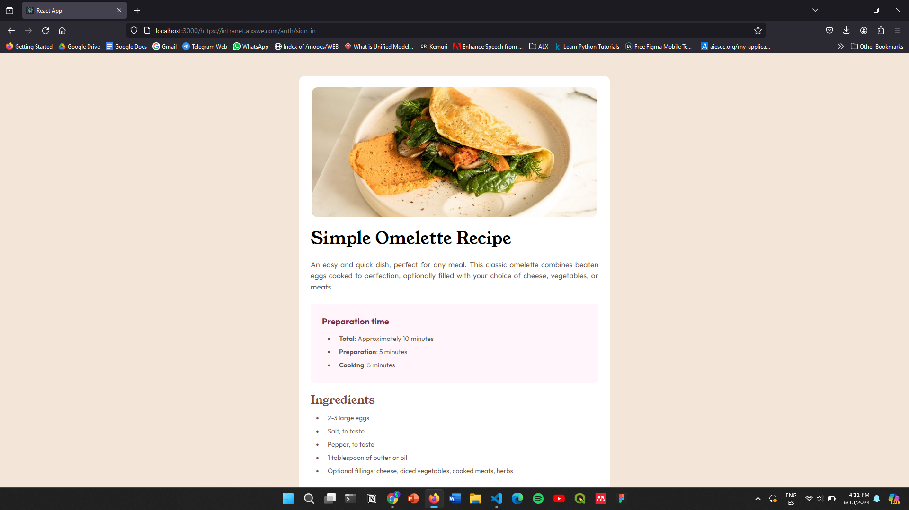
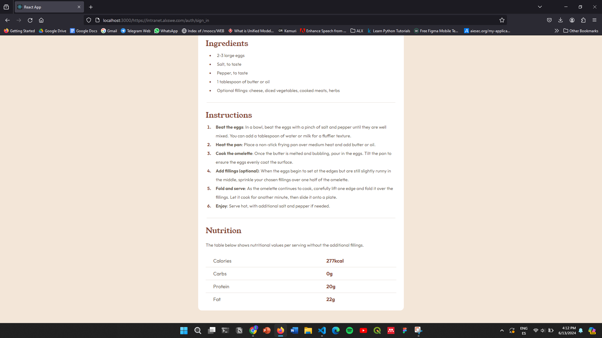
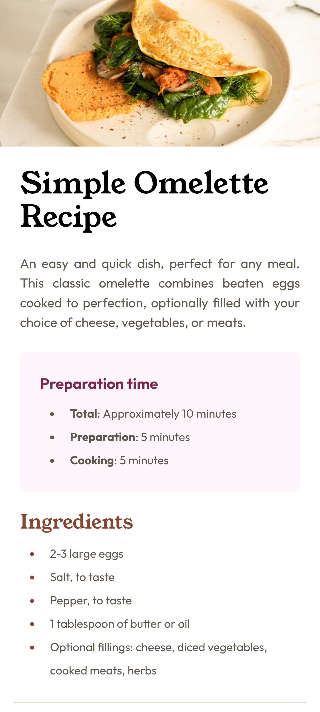
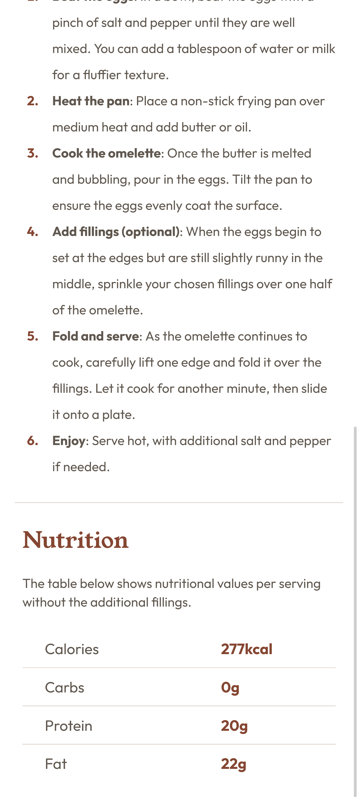

#Recipe page solution

This is a solution to the [Recipe page challenge on Frontend Mentor](https://www.frontendmentor.io/challenges/recipe-page-KiTsR8QQKm). Frontend Mentor challenges help you improve your coding skills by building realistic projects. 

## Table of contents

- [Overview](#overview)
  - [Screenshot](#screenshot)
  - [Built with](#built-with)
  - [What I learned](#what-i-learned)
- [Author](#author)

## Overview

### Screenshot

#### Desktop: 1440px

#### Mobile: 375px

### Links

- Solution URL: [Add solution URL here](https://your-solution-url.com)
- Live Site URL: [Add live site URL here](https://your-live-site-url.com)

## My process
First, I structured the HTML content. Then, I applied Tailwind CSS classes for styling and visualization. Afterward, I added the fonts and colors. Initially, all these steps were focused on the desktop version of the page. Finally, I added media queries to ensure the page is responsive on smaller devices, particularly mobile phones. And voilà, the page was complete!

### Built with and using
- Bun instead of Node
- React Js
- CSS custom properties
- Flexbox
- Tailwindcss
- [React](https://reactjs.org/) - JS library
- [tailwind css](https://tailwindcss.com/) - Tailwindcss framework for styling
- [Bun](https://bun.sh/) - Bun JavaScript runtime & package manager

### What I learned

During this project, I gained valuable experience with Tailwind CSS, understanding how to efficiently apply utility classes to streamline styling and ensure a responsive design. Additionally, I learned how to integrate and utilize Bun, a fast JavaScript bundler, with React.js. This involved setting up Bun in a React environment, optimizing the build process, and leveraging its performance benefits. Overall, these new skills have significantly enhanced my proficiency in modern web development tools and techniques.

### Useful resources

- [Example resource 1](https://flowbite.com/docs/customize/theming/) - This helped me understand the theming and how to use it
- [Example resource 2](https://bun.sh/docs/installation) - This is an amazing doc will help you understand and setup bun on your machine
- [Example resource 2](https://bun.sh/guides/ecosystem/react) - and this guide will help you set up and know how to use bun with react
- Down is cheatsheet I relayed on to do most of the job required a big thanks to [@umeshmk](https://github.com/umeshmk) for he's efforts.

## Author

- Frontend Mentor - [@@bouhvli](https://www.frontendmentor.io/profile/bouhvli)
- Twitter - [@bouhvli](https://x.com/bouhvli)
- LinkedIn - [@bouhali-hamza](https://www.linkedin.com/in/bouhali-hamza/)
- Instagram - [@bouhvli](https://www.instagram.com/bouhvli/)
